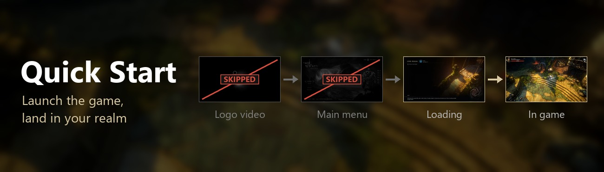
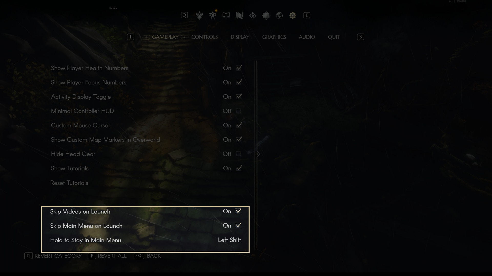

# Quick Start



A [MelonLoader](https://github.com/LavaGang/MelonLoader) mod for **No Rest for the Wicked** that takes you from the
desktop straight into your realm: launch the game and you arrive in the world with your last played character, without
touching anything.

Download: [Nexus Mods](https://www.nexusmods.com/norestforthewicked/mods/105) · [GitHub releases](https://github.com/vergir/NRftW-QuickStart/releases/latest)

## Features

* **Skips the logo video** when the game starts.
* **Skips the main menu:** as soon as the menu is ready, the mod presses **Continue** for you, so you load into the last
  realm of your last played character.

Details:

* It uses the game's own Continue button, so the game decides where to go and handles problems: if the realm can't be
  joined, you land in the main menu as usual.
* It happens once per launch. Quitting to the main menu from a realm keeps you there.
* **Hold Left Shift while the game loads** to stay in the main menu this time. The key can be changed in Options.
* With no character yet there is nothing to continue, and the mod leaves the menu alone. The same goes if you open
  another screen (character creation, settings) before Continue is available.
* The loading itself takes as long as before; the mod removes the stops around it.

## Settings

At the bottom of **Options > Gameplay**:

* **Skip Videos on Launch** and **Skip Main Menu on Launch**, both on by default. They take effect at the next launch.
* **Hold to Stay in Main Menu**: the key to hold while the game loads, Left Shift by default. Click it and press any
  key, like in the game's key bindings; Esc cancels, Backspace sets none.



Everything is also in `<game>/UserData/MelonPreferences.cfg`, section `[QuickStart]`:

| Setting | Default | |
|---|---|---|
| `Enabled` | `true` | Master switch. |
| `SkipVideos` | `true` | Skip the logo video when the game starts. |
| `SkipMainMenu` | `true` | Press Continue on the main menu once per launch. |
| `StayKey` | `"LeftShift"` | Hold it while the game loads to stay in the main menu. Any Unity [KeyCode](https://docs.unity3d.com/ScriptReference/KeyCode.html) name; empty = no key. |
| `Delay` | `0` | Seconds to wait once Continue is available before pressing it. |
| `Timeout` | `60` | Give up if Continue is still unavailable this many seconds after the main menu appears. |
| `AddSettingsRows` | `true` | Add the rows to Options > Gameplay. |

## Install

1. Install [MelonLoader](https://github.com/LavaGang/MelonLoader/releases) **0.7.3** or newer into the game
   (`...\steamapps\common\NoRestForTheWicked`) and start the game once.
2. Put `QuickStart.dll` into the game's `Mods` folder (the [release zip](https://github.com/vergir/NRftW-QuickStart/releases/latest)
   already has that layout: extract it into the game folder).

### Steam Deck / Linux (Proton)

1. Install MelonLoader into the game folder the same way (copy the files from `MelonLoader.x64.zip`, the Windows build,
   into `~/.local/share/Steam/steamapps/common/NoRestForTheWicked`), and the mod into `Mods`.
2. In Steam, open the game's **Properties > General > Launch Options** and enter:
   ```
   WINEDLLOVERRIDES="version=n,b" %command%
   ```
3. Start the game. On the first start MelonLoader installs the .NET runtime it needs by itself; that start takes a
   minute or two.

Without a keyboard there is no Left Shift to hold: turn **Skip Main Menu on Launch** off in Options when you want the
menu, or map a back button to Left Shift in Steam Input.

## Compatibility

* Tested with game build 29466 and MelonLoader 0.7.3 on Windows.
* Nothing in the game simulation or your save is changed. Continue works exactly as when you click it, online realms
  included.
* Game updates can move things around. If the mod stops working after an update, check the MelonLoader log
  (`<game>/MelonLoader/Latest.log`, lines starting with `[Quick_Start]`) and open an issue.

## Build

Requires a .NET SDK (6 or newer) and MelonLoader installed in the game (so `MelonLoader/Il2CppAssemblies` exists).

```
dotnet build -c Release
```

The DLL is copied to `<game>/Mods` after every build (`-p:DeployToGame=false` to skip, `-p:GameDir=...` if the game is
installed elsewhere). `pwsh ./package.ps1` builds the release zip into `dist/`. The Nexus / README images are built by
`python docs/pics/make_nexus_images.py` from raw screenshots that are not in the repository.

## License

[MIT](LICENSE)
